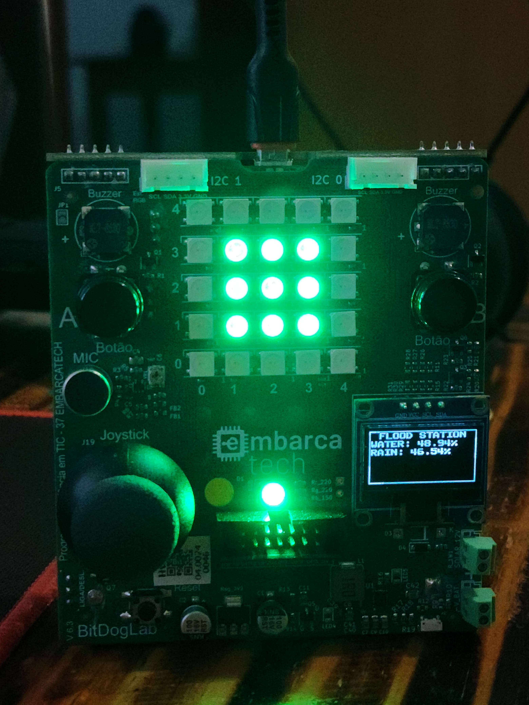
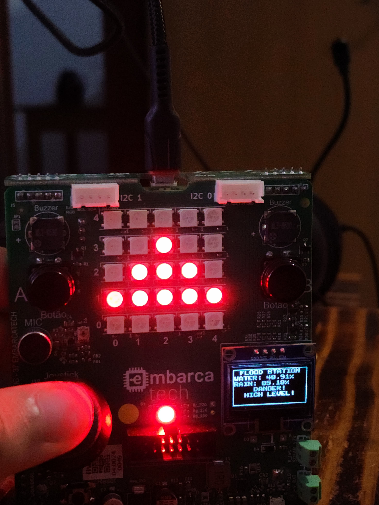

# Título do Projeto  

Estação de inundação

# Objetivo Geral  

O objetivo do projeto é monitorar um determinado ambiente utilizando sensores para capturar parâmetros de n**ível de água** e **volume de chuva**, a fim de evitar cheias na região.

O projeto é capaz de fornecer os parâmetros mencionados e oferecer alertas caso os níveis elevem em demasia.

# Descrição Funcional  

O sistema deve ser capaz de monitorar o ambiente e avisar sobre enchentes e inundações que podem ocorrer. Para isso, alguns dados do ambiente devem ser obtidos, e nesse caso escolheu-se **volume de chuva** e **nível de água**.

Para que esses dados capturados sejam apresentados, e para que os avisos, sejam sonoros ou visuais, possam ser executados, é necessário alguns periféricos para a estação. Nesse caso, foi utilizado **display OLED**, **LEDs RGB**, **Matriz de LEDs** e **Buzzers** sonoros.

Além disso, para atingir o objetivo do projeto, foi utilizado um *Sistema Operacional em Tempo Real* (**RTOS**) para dividir as funcionalidades em tarefas e o microcontrolador ser capaz de fazer todas as funcionalidades de forma concorrente.

Para isso, foram criadas quatro tarefas distintas capazes de modularizar e, como principal função, trazer mais agilidade. Além das tarefas, foi necessário a utilização de uma fila capaz de armazenar valores e fazer com que esses valores possam ser utilizados em outras tarefas, sem perigo de concorrência.

Já em execução, o sistema possui **dois modos de operação**: **Normal Mode**, visto na figura 1, e **Alert Mode**, visto na figura 2,. O primeiro é responsável por monitorar e não emitir avisos, apenas informações visuais informando que está tudo bem e que os níveis estão controlados. Já o segundo modo de operação é o modo de alerta, capaz de emitir sons, alertas vermelhos e mensagens de perigo caso os níveis ultrapassem limites perigosos: para o **nível de água** maior ou igual a **70%** e para o **volume de chuva** maior ou igual a **80%**.

> Modo de operação normal
> 
> **Figura 1**: Sistema em modo **Normal Mode**

> Modo de operação de Alerta
> 
> **Figura 2**: Sistema em modo **Alert Mode**

# BitDogLab e Código

Como foi mencionado na sessão anterior, o código foi dividido em tarefas dentro do sistema operacional usado, para que as funcionalidades executem concorrentemente e com mais agilidade, sem travamento. Essas tarefas são: **vReadSensorsTask**, **vControlModeTask**, **vNormalModeTask**, **vAlertModeTask**.

**vReadSensorsTask** foi responsável por fazer a leitura dos sensores de **nível de água** e **volume de chuva**, simulados por **potenciômetros**, e enfileirar esses valores em uma fila. Esses valores são lidos a cada 300 milissegundos, usando *ticks* do **RTOS**.

**vControlModeTask** é basicamente o controlador da estação. Essa *task* desenfileira os valores da fila, verifica em quanto estão, e com base nesses valores suspende ou executa as outras duas *tasks*. Além disso, mostra os valores capturados da fila no **display OLED**, para que os usuários possam ver os níveis dos parâmetros. Em modo de alerta, ainda é plotado no display um aviso de perigo.

As outras duas *tasks* são referentes aos modos de operação. A **vNormalModeTask**, mais simples, acende **LEDs** verdes em um quadrado na **matriz de LEDs**, para indicar que os níveis estão seguros. Já a outra task, **vAlertModeTask**, é responsável por ligar o **buzzer** como aviso sonoro, mostrar um triângulo vermelho na **matriz de LEDs** e acender um **LED** vermelho, indicando perigo.

No lugar de usar variáveis globais, foram utilizadas filas e funções de suspensão e execução de tarefas, afim de controlar a concorrência e tirar proveito ao máximo das funcionalidades dessas duas ferramentas do **RTOS**.

# Links para acesso ao código e ao vídeo. 
